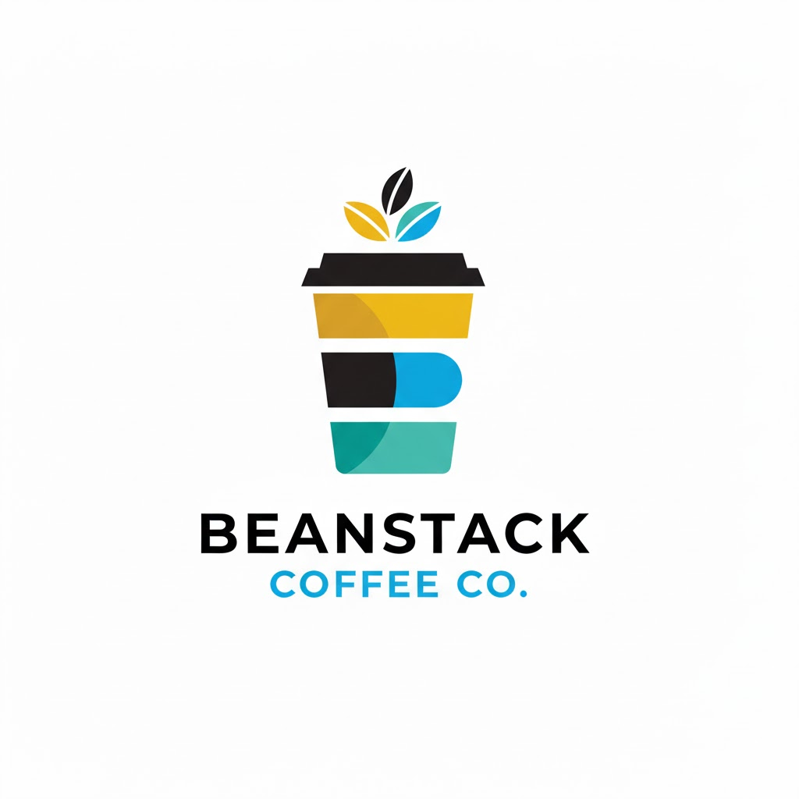

<p align="center">
  
</p>

<h1 align="center">BeanStack Elastic Agent</h1>

<p align="center">
  AI-powered operational intelligence for a 100+ branch coffee chain.<br>
  Built for the <a href="https://elasticsearch.devpost.com/">Elastic Agent Builder Hackathon</a>.
</p>

---

## What is BeanStack?

BeanStack is a conversational agent that helps coffee chain HQ staff monitor operations, analyze branch reports, and communicate with managers -- all through natural language in Kibana.

It combines **Elasticsearch hybrid search** (Cohere embeddings + BM25 via RRF), **Kibana Workflows** for automation, and the **Elastic Agent Builder** for orchestration.

**Key capabilities:**

- Summarize the last 24 hours across all branches
- Search unstructured weekly manager reports with time and geo filters
- Compare revenue, labor costs, and satisfaction across branches and regions
- Identify branches with missing or overdue reports
- Send emails and escalate critical issues via Kibana Workflows

## Setup

### Prerequisites

| Service | Purpose |
|---------|---------|
| Elastic Cloud (9.x) | Elasticsearch + Kibana with Agent Builder |
| Cohere | Embed v4 text embeddings |
| Anthropic | Synthetic data generation (Claude Haiku 4.5) |
| SMTP provider | Email connector (Gmail, SendGrid, etc.) |

### 1. Install

```bash
git clone <repo-url>
cd elastic-agent-hackathon
uv sync
```

### 2. Configure `.env`

Copy the example and fill in your credentials:

```bash
cp .env.example .env
```

### 3. Generate synthetic data

```bash
uv run python scripts/data_generation/branches.py
uv run python scripts/data_generation/staff.py
uv run python scripts/data_generation/weekly_reports.py
uv run python scripts/data_generation/quarterly_reports.py
```

### 4. Set up Elasticsearch

```bash
uv run python scripts/es_setup/00_init_es.py        # Enable features & email connector
uv run python scripts/es_setup/01_setup_indices.py   # Create indices & inference endpoint
uv run python scripts/es_setup/02_ingest_data.py     # Ingest branches & staff
uv run python scripts/es_setup/03_ingest_reports.py  # Ingest weekly reports
uv run python scripts/es_setup/04_ingest_financial.py # Ingest financial reports
```

### 5. Deploy workflows and agent

```bash
uv run python scripts/es_setup/10_setup_workflows.py  # Kibana Workflows
uv run python scripts/es_setup/11_setup_agent.py      # BeanStack agent + tools
```

### 6. Use it

Open Agent Builder in Kibana and try:

- *"Give me a daily brief"*
- *"What equipment issues were reported in the Northeast last month?"*
- *"Compare revenue between West and Midwest for Q4 2025"*
- *"Which branches haven't submitted reports this week?"*
- *"Send a message to the manager of branch-042 about their espresso machine"*
